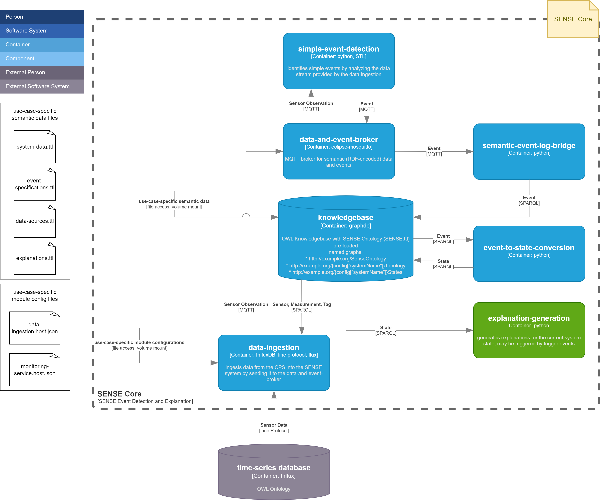

# Sense Core - Introduction

The SENSE Core is a result of the Semantics-based Explanation of Cyber-physical Systems (SENSE) research project. For basic information, please refer to the [SENSE homepage](https://sense-project.net/). The SENSE Core is a container-based application. It is structured and implemented according to the [Auditable SENSE Architecture](https://sense-project.net/wp-content/uploads/2024/06/D3_1_Auditable-SENSE-architecture.pdf).

This repository primarily contains the source code of all SENSE Core modules and instructions (Dockerfiles) for building images for each of the modules. We also provide pre-built image files. However, you currently need access to the container registry at [registry.ai.wu.ac.at](registry.ai.wu.ac.at).

## Table of Contents

- [TODOs](#todos)
- [SENSE Core Structure](#sense-core-structure)
- [Instantiation and Execution](#instantiation-and-execution)
- [Structure of the Repository](#structure-of-the-repository)
- [Named Graphs and Namespaces](#named-graphs-and-namespaces)
- [Configuration Files](#configuration-files)
- [GitLAB CI/CD](#gitlab-cicd)
- [License](#license)
- [References](#references)
- [Contributing](#contributing)
- [Contact](#contact)

## TODOs

- [ ] License?
- [ ] Replace the links to the Demo Use Case and the Use Case Template repositories when they are published to GitHub

## SENSE Core Structure

This repository provides the modules/services making up the SENSE Core. Note that the SENSE Core itself is not an executable application as it lacks use-case-specific system data. For information on how to create an instance of the SENSE Core, please refer to Section [Instantiation and Execution](#instantiation-and-execution).



The structure and interdependencies of the SENSE Core modules are as follows:

- **data-ingestion:** This module is responsible for feeding sensor readings into the SENSE system. It currently supports data import from an 
InfluxDB time-series database, as this is often available in existing CPSs. The module can be configured to replay data from the time-series database for testing purposes. Alternatively, it can be configured to ingest data that is added to the time-series database into the SENSE system for "live" operation. [Further Information](sense_core/data_ingestion/README.md)
- **data-and-event-broker:** This module provides a [Mosquitto MQTT broker](https://mosquitto.org/) for message exchange between modules, as indicated in the figure above. It uses the official [eclipse-mosquitto](https://hub.docker.com/_/eclipse-mosquitto) docker image. Hence, no Dockerfile or source code is provided for the data-and-event-broker in this repository.
- **simple-event-detection:** This module is responsible for detecting simple events in the sensor time-series data. Events can currently be specified in Signal Temporal Logic (STL). [Further Information](sense_core/simple_event_detection/README.md)
- **semantic-event-log-bridge:** This module is responsible for listening for detected events and publishing them in the semantic event log, which resides within the knowledgebase. Currently, only a GraphDB is supported as an event log. [Further Information](sense_core/semantic_event_log_bridge/README.md)
- **knowledgebase:** This module is responsible for providing semantic data storage to the SENSE system. It initializes the semantic data storage [GraphDB](https://graphdb.ontotext.com/) with a repository, named graphs, and ttl files as defined in the configuration. [Further Information](sense_core/knowledgebase/README.md)
- **event-to-state-causality:** This module contains a Java-based application that connects to the data-and-event-broker, subscribes to a topic, and processes incoming messages to infer event-to-state causality. The inferred states are then inserted into the knowledgebase. [Further Information](sense_core/event-to-state-causality/README.md)
- **explanation-interface:** This module contains a Java-based application that provides explanations for specific states identified from a semantic model and, if needed, a way to integrate chatbot data. The application connects to a SPARQL endpoint to fetch causal relationships and returns them as JSON responses via a Spring-boot API. [Further Information](sense_core/explanation-interface/README.md)

## System Requirements
The system requirements below were obtained by running the [Demo Use Case](https://git.ai.wu.ac.at/sense/seehub) via the following commands:
 
```
docker ps -s # virtual size = read-only image data used by the container plus the container's writable layer
```

```
docker stats
```
 

| Module | Container Size | Min System Memory (RAM) Requirement
| --- | --- | --- |
| simple-event-detection | 84 MB | 34 MB |
| data-and-event-broker | 14 MB | 2 MB |
| knowledgebase | 772 MB | 1623 MB |
| data-ingestion | 92 MB | 43 MB |
| semantic-event-log-bridge | 80 MB | 26 MB |
| event-to-state-causality | 440 MB | 36 MB |
| explanation-interface | 462 MB | 52 MB |
| influxdb | 369 MB | 328 MB |
| --- | --- | --- |
| TOTAL | 2002 MB | 2144 MB |

## Instantiation and Execution
As mentioned, the SENSE Core is not an executable application by itself but needs to be configured according to the specific use case. This process is referred to as "instantiation". We provide two possible approaches: [(1)](#use-the-demo-use-case) starting with an executable demo use case and [(2)](#use-the-use-case-template) starting with a use case template.

### Use the Demo Use Case
You can use our [Demo Use Case](https://git.ai.wu.ac.at/sense/seehub) of the SENSE Core to quickly start with a running demo application. Instructions about how to get it up and running are provided in the README of the Demo Use Case repository.

### Use the Use Case Template
We also provide this [Use Case Template](https://git.ai.wu.ac.at/sense/use-case-template) repository as a starting point for creating a new SENSE instance. Instructions about how to get it up and running are provided in the README of the Use Case Template repository. 


## Structure of the Repository
```
├── README.md
├── doc # figures etc. for the README
│   ├── ...
└── sense_core # implementations for the SENSE Core modules
    ├── config # configuration files intended for development (cf. [Configuration Files](#configuration-files))
    │   ├── data_ingestion.host.json
    │   ├── ...
    ├── data_ingestion # implementation of the data_ingestion module
    │   ├── ...
    ├── data_ingestion.Containerfile # Containerfile to build the data_ingestion module image
    ├── data_ingestion.py # entrypoint for the data_ingestion container
    ├── knowledgebase
    │   ├── data
    │   │   └── SENSE.ttl
    │   ├── ...
    ├── knowledgebase.Containerfile
    ├── knowledgebase.sh
    ├── semantic_event_log_bridge.Containerfile
    ├── shared # python code used by multiple modules
    │   ├── ...
    ├── simple_event_detection
    │   ├── ...
    ├── simple_event_detection.Containerfile
    └── simple_event_detection.py
└── .gitlab-ci.yml # gitlab CI/CD config (cf. [GitLAB CI/CD](#gitlab-cicd))
```

## Named Graphs and Namespaces
Data within the knowledgebase is organized in different named graphs according to  [SENSE Named Graph List.xlsx](https://wu.sharepoint.com/:x:/r/sites/PR-FFGSENSE/Freigegebene%20Dokumente/General/1_WorkPackages/WP4_Semantics-basedEventExplainability/4.1%20SENSE%20Semantic%20Model/SENSE%20Named%20Graph%20List.xlsx?d=w136542f1c78046dfa38a3af2cea52535&csf=1&web=1&e=01o5Rt)

## Configuration Files
Currently, we use configuration files that are specific to each module, e.g., there is a configuration file for the knowledgebase, another one for data_ingestion, etc. Eventually, we plan to merge these configuration files into one file, eliminating redundant entries/definitions.

### Configuration Files for Development
Configuration files with the file ending `host.json` are intended to be used for development only. As an example, if you want to work on the data_ingestion module, you can start all other modules within their corresponding containers and execute the data_ingestion script with its corresponding data_ingestion.host.json on your host machine.

### Configuration Files for Operation
Configuration files with the file ending `docker.json` are intended to be used when running the module in its corresponding container. They are supplied to the containers via volume mounts. As the SENSE Core is not intended to be executed, configuration files with the file ending `docker.json` should only be located in the corresponding instances. However, we provide templates for `docker.json` configuration files also via the [Use Case Template](https://git.ai.wu.ac.at/sense/use-case-template) repository.

## GitLAB CI/CD
CI/CD build instructions for each image are defined in .gitlab-ci.yml.

## License

## References

## Contributing

## Contact