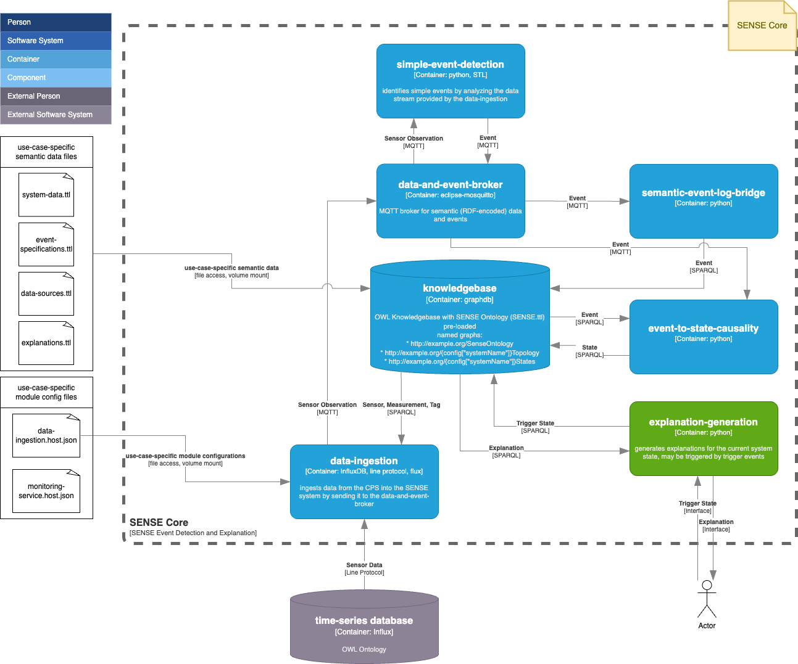

# Sense Core - Introduction

The SENSE Core is a result of the Semantics-based Explanation of Cyber-physical Systems (SENSE) research project. For basic information, please refer to the SENSE homepage https://sense-project.net/. 

# Table of Contents

- [TODOs](#todos)
- [SENSE Core Structure](#sense-core-structure)
- [Instantiation and Execution](#instantiation-and-execution)
- [License](#license)
- [References](#references)
- [Contributing](#contributing)
- [Contact](#contact)

## TODOs

- [ ] License?
- [ ] Main README
- [ ] Documentation. Probably create a docs folder
- [ ] Relevant References
- [ ] Repository for a demo instantiation
- [ ] Config for SENSE Core Components

## SENSE Core Structure

This repository provides the necessary containers making up the SENSE Core. Note that the SENSE Core itself is not an executable application as it lacks use-case specific system data. For a demo instantiation of the SENSE Core, please refer to  [Demo Instantiation](#) (TODO: Insert Link to BIFROST Demo instantiation).

The structure and interdependencies of the SENSE Core components are as follows:

- **Component 1**: Description of component 1.
- **Component 2**: Description of component 2.
- **Component 3**: Description of component 3.

## Instantiation and Execution
As mentioned, the SENSE Core is not an executable application by itself but needs to be configured according to the specific use case. This process is referred to as "instantiation". You can also use our demo instantiation of the SENSE Core to quickly start with a running demo application.

1. **Prepare the Configuration**
   - Detail the initial setup and configuration requirements.

2. **Deploy the Containers**
   - Instructions for deploying the necessary containers.

3. **Run the Application**
   - Steps to start the application and verify it is running correctly.

## License

## References

## Contributing

## Contact