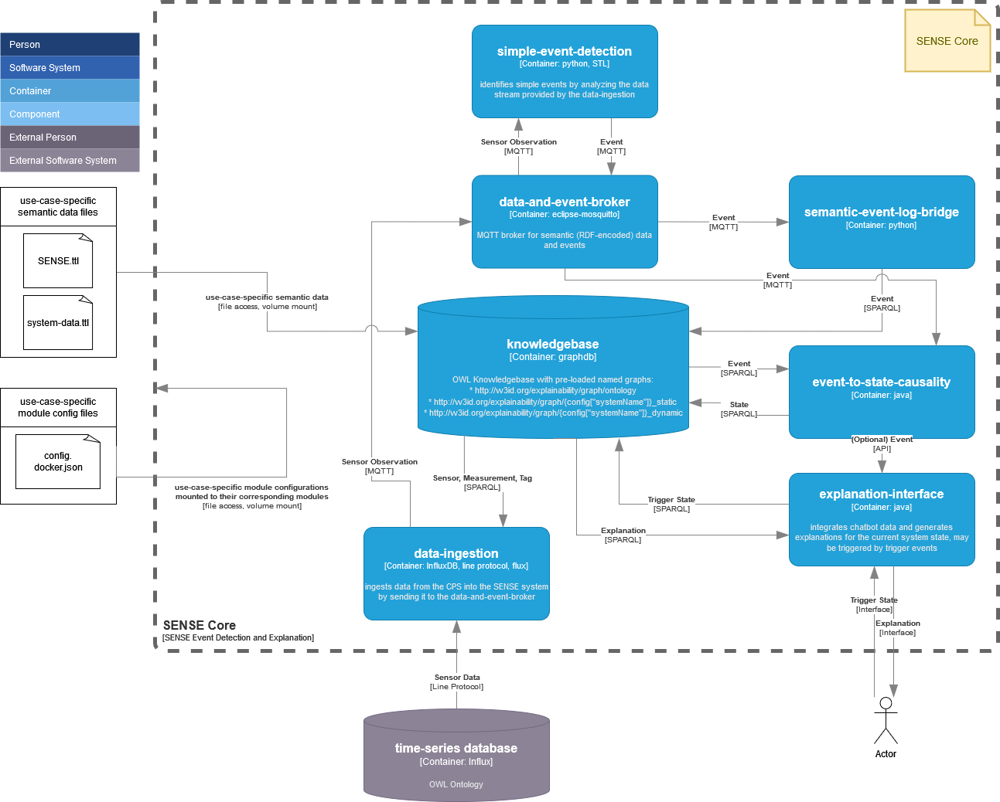

# Sense Core - Introduction

The SENSE Core is a result of the Semantics-based Explanation of Cyber-physical Systems (SENSE) research project. For basic information, please refer to the SENSE homepage https://sense-project.net/. 


# Table of Contents

- [TODOs](#todos)
- [SENSE Core Structure](#sense-core-structure)
- [Instantiation and Execution](#instantiation-and-execution)
- [Structure of the Repository](#structure-of-the-repository)
- [Named Graphs and Namespaces](#named-graphs-and-namespaces)
- [Configuration Files](#configuration-files)
- [GitLAB CI/CD](#gitlab-cicd)
- [License](#license)
- [References](#references)
- [Contributing](#contributing)
- [Contact](#contact)

## TODOs

- [ ] License?
- [ ] Main README
- [ ] Documentation. Probably create a docs folder
- [ ] Relevant References
- [ ] Repository for a demo instantiation
- [ ] Config for SENSE Core Components

## SENSE Core Structure

This repository provides the necessary containers making up the SENSE Core. Note that the SENSE Core itself is not an executable application as it lacks use-case specific system data. For a demo instantiation of the SENSE Core, please refer to  [Demo Instantiation](https://git.ai.wu.ac.at/sense/seehub) (TODO: Replace this link, which directs to our internal seehub demo use case, to the public BIFROST Demo instantiation).



The structure and interdependencies of the SENSE Core components are as follows:

- **Component 1**: Description of component 1.
- **Component 2**: Description of component 2.
- **Component 3**: Description of component 3.

## Instantiation and Execution
As mentioned, the SENSE Core is not an executable application by itself but needs to be configured according to the specific use case. This process is referred to as "instantiation". You can also use our [Demo Instantiation](https://git.ai.wu.ac.at/sense/seehub) (TODO: Replace this link, which directs to our internal seehub demo use case, to the public BIFROST Demo instantiation) of the SENSE Core to quickly start with a running demo application.


1. **Prepare the Configuration**
   - Detail the initial setup and configuration requirements.

2. **Deploy the Containers**
   - Instructions for deploying the necessary containers.

3. **Run the Application**
   - Steps to start the application and verify it is running correctly.

## Structure of the Repository
```
├── README.md
├── doc # figures etc. for the README
│   ├── ...
└── sense_core # implementations for the SENSE Core modules
    ├── config # configuration files intended for development (cf. [Configuration Files](#configuration-files))
    │   ├── data_ingestion.host.json
    │   ├── ...
    ├── data_ingestion # implementation of the data_ingestion module
    │   ├── ...
    ├── data_ingestion.Containerfile # Containerfile to build the data_ingestion module image
    ├── data_ingestion.py # entrypoint for the data_ingestion container
    ├── knowledgebase
    │   ├── data
    │   │   └── SENSE.ttl
    │   ├── ...
    ├── knowledgebase.Containerfile
    ├── knowledgebase.sh
    ├── semantic_event_log_bridge.Containerfile
    ├── shared # python code used by multiple modules
    │   ├── ...
    ├── simple_event_detection
    │   ├── ...
    ├── simple_event_detection.Containerfile
    └── simple_event_detection.py
└── .gitlab-ci.yml # gitlab CI/CD config (cf. [GitLAB CI/CD](#gitlab-cicd))
```

## Named Graphs and Namespaces
Data within the knowledgebase is organized in different named graphs according to  [SENSE Named Graph List.xlsx](https://wu.sharepoint.com/:x:/r/sites/PR-FFGSENSE/Freigegebene%20Dokumente/General/1_WorkPackages/WP4_Semantics-basedEventExplainability/4.1%20SENSE%20Semantic%20Model/SENSE%20Named%20Graph%20List.xlsx?d=w136542f1c78046dfa38a3af2cea52535&csf=1&web=1&e=01o5Rt)


## Configuration Files
Currently, we use configuration files that are specific to each module, e.g., there is a configuration file for the knowledgebase, another one for data_ingestion, etc. Eventually, we plan to merge these configuration files into one file, eliminating redundant entries/definitions.

### Configuration Files for Development
Configuration files with the file ending `host.json` are intended to be used for development only. As an example, if you want to work on the data_ingestion module, you can start all other modules within their corresponding containers and execute the data_ingestion script with its corresponding data_ingestion.host.json on your host machine.

### Configuration Files for Operation
Configuration files with the file ending `docker.json` are intended to be used when running the module in its corresponding container. They are supplied to the containers via volume mounts. As the SENSE Core is not intended to be executed, configuration files with the file ending `docker.json` should only be located in the corresponding instantiations. Eventually, we might provide templates or example `docker.json` configuration files also with the SENSE Core repository.

## GitLAB CI/CD
CI/CD build instructions for each image are defined in .gitlab-ci.yml.

## License

## References

## Contributing

## Contact